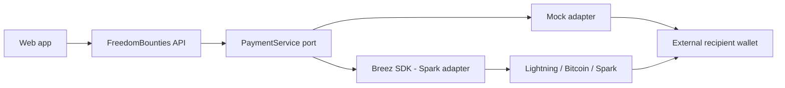

# FreedomBounties

[English](README.md) | [Português do Brasil](README.pt-BR.md)

> Embedding Bitcoin into everyday applications — without building another wallet.

FreedomBounties is a production-minded, workshop-friendly skill-bounty application. An organizer approves useful work and asks a payment service to pay the contributor through Bitcoin over Lightning, Bitcoin on-chain, or Spark. The recipient uses any compatible external wallet and never gives FreedomBounties private keys, seed phrases, credentials, or signing material.

Recipients remain self-custodial. FreedomBounties controls only its small operational payout treasury. This is educational software, not audited production payment software.

## What we are building

An ordinary web application with a payment-service boundary: the bounty domain expresses a payment intent; the service parses the destination, chooses a supported route, validates amount and fees, prepares the payment, enforces policy and idempotency, sends it, and reconciles status. We are deliberately **not** building wallet creation, recovery, seed backup, a portfolio, token management, or swaps.



The seeded scenario is “Deliver an introductory workshop on personal finance and macroeconomics,” a 60-minute Portuguese session helping women starting their careers understand inflation, interest rates, reserves, risks, and everyday macroeconomics. Its executable reward is only `100 sats`.

## Live path

Open bounty → inspect submitted work → approve submission → paste a payment destination → validate → review amount and fee → confirm → see the payment succeed.

Mock destinations include `mentor@example.com`, `lnbc1workshopdemo`, `bc1qworkshopdemo`, and `spark1workshopdemo`. Add `fail` to a supported mock destination to demonstrate failure. No real funds move in default mode.

## Prerequisites and quick start

- Go 1.24 or newer (the project was validated with Go 1.26)
- Node.js 24 LTS and npm 11
- Linux/Fedora first-class; macOS and Windows notes are in the running guide

```bash
cp .env.example .env
make setup
make dev
```

Open <http://localhost:5173>. You can instead use two terminals with `make api` and `make web`. Reset with `make reset`.

## Real Breez mode

The released Go binding embeds a native CGO runtime, so real mode is deliberately opt-in. Set the values in `.env` — `make dev` and `make api` load it and automatically build with `-tags breez` when `PAYMENT_PROVIDER=breez`:

```bash
# .env
PAYMENT_PROVIDER=breez
BREEZ_API_KEY=your-key
# Quote the mnemonic — it contains spaces and .env is shell-sourced:
BREEZ_MNEMONIC="word1 word2 … word12"
```

```bash
make dev   # loads .env, builds the Breez binding, runs API + web
```

If sourcing `.env` prints `command not found`, a multi-word value (usually the mnemonic) is unquoted — wrap it in quotes.

Equivalently, run the binary directly without `.env`:

```bash
cd services/freedom-bounties-api
PAYMENT_PROVIDER=breez BREEZ_API_KEY='…' BREEZ_MNEMONIC='…' \
  go run -tags breez ./cmd/api
```

Use a separately funded, low-value treasury. Never paste a mnemonic into the browser or commit it (`.env` is gitignored). By default (`BREEZ_NETWORK` unset or `mainnet`) Lightning testing moves **real mainnet satoshis**; set `BREEZ_NETWORK=regtest` for Spark/on-chain testing without real funds. See [Breez integration](docs/en-US/07-breez-integration.md) before enabling this mode.

## Read the code by concept

- Application contract and normalized money model: [`internal/payment/models.go`](services/freedom-bounties-api/internal/payment/models.go)
- Mock provider: [`internal/payment/mock/service.go`](services/freedom-bounties-api/internal/payment/mock/service.go)
- Breez adapter: [`internal/payment/breez/adapter.go`](services/freedom-bounties-api/internal/payment/breez/adapter.go)
- Policy, idempotency, reconciliation: [`internal/payout/service.go`](services/freedom-bounties-api/internal/payout/service.go)
- SQLite constraints: [`internal/platform/database/database.go`](services/freedom-bounties-api/internal/platform/database/database.go)
- Safe HTTP boundary: [`internal/platform/httpserver/server.go`](services/freedom-bounties-api/internal/platform/httpserver/server.go)
- Guided browser flow: [`PayoutFlow.tsx`](apps/freedom-bounties-web/src/features/payouts/PayoutFlow.tsx)

## Workshop material

Start with [concept](docs/en-US/01-concept.md), [architecture](docs/en-US/02-architecture.md), [domain model](docs/en-US/03-domain-model.md), [assets and rails](docs/en-US/04-payment-assets-and-rails.md), [payment lifecycle](docs/en-US/05-payment-lifecycle.md), [running the demo](docs/en-US/06-running-the-demo.md), [Breez integration](docs/en-US/07-breez-integration.md), [security](docs/en-US/08-security-model.md), [two-hour walkthrough](docs/en-US/09-workshop-walkthrough.md), [troubleshooting](docs/en-US/10-troubleshooting.md), and [next steps](docs/en-US/11-next-steps.md). Current SDK/release constraints are in [implementation notes](docs/en-US/00-implementation-notes.md).

Run every check with `make check`. See [CONTRIBUTING.md](CONTRIBUTING.md), [SECURITY.md](SECURITY.md), and the existing MIT [`LICENSE`](LICENSE).
