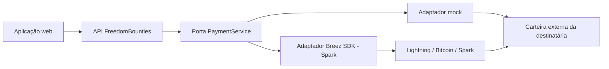

# FreedomBounties

[English](README.md) | [Português do Brasil](README.pt-BR.md)

> Incorporando Bitcoin a aplicações do dia a dia — sem criar outra carteira.

FreedomBounties é uma aplicação de recompensas por habilidades, pensada para produção e didática em oficinas. Uma pessoa organizadora aprova um trabalho útil e pede ao serviço de pagamentos que remunere a colaboradora por Lightning, Bitcoin on-chain ou Spark. A destinatária usa qualquer carteira externa compatível e nunca entrega chaves privadas, palavras-semente, credenciais nem material de assinatura ao FreedomBounties.

As destinatárias mantêm a autocustódia. O FreedomBounties controla apenas seu pequeno tesouro operacional para pagamentos. Este é um software educacional, não um sistema de pagamentos auditado para produção.

## O que estamos construindo

Uma aplicação web comum com uma fronteira de serviço de pagamentos. O domínio declara a intenção; o serviço interpreta o destino, escolhe uma rota compatível, valida valor e taxas, prepara, aplica políticas e idempotência, envia e reconcilia o estado. Deliberadamente não criamos carteira, recuperação, backup de seed, portfólio, gestão de tokens ou swaps.



O cenário inicial é “Ministrar uma oficina introdutória sobre finanças pessoais e macroeconomia”, em português, com 60 minutos. A recompensa executável é segura para demonstração: `100 sats`.

## Caminho ao vivo

Abrir recompensa → inspecionar entrega → aprovar → colar destino → validar → revisar valor e taxa → confirmar → acompanhar sucesso.

Destinos mock: `mentor@example.com`, `lnbc1workshopdemo`, `bc1qworkshopdemo` e `spark1workshopdemo`. Acrescente `fail` a um destino mock compatível para demonstrar falha. Nenhum valor real se move no modo padrão.

## Início rápido

Requer Go 1.24+, Node.js 24 LTS e npm 11. Linux/Fedora é a plataforma prioritária.

```bash
cp .env.example .env
make setup
make dev
```

Abra <http://localhost:5173>. Também é possível usar `make api` e `make web` em dois terminais. Use `make reset` para reiniciar os dados.

O modo Breez real exige o build nativo e um tesouro pequeno, separado e financiado. Defina os valores no `.env` — `make dev` e `make api` carregam o arquivo e compilam automaticamente com `-tags breez` quando `PAYMENT_PROVIDER=breez`:

```bash
# .env
PAYMENT_PROVIDER=breez
BREEZ_API_KEY=sua-chave
# Coloque a mnemonic entre aspas — ela contém espaços e o .env é lido pelo shell:
BREEZ_MNEMONIC="palavra1 palavra2 … palavra12"
```

```bash
make dev   # carrega o .env, compila o binding Breez e sobe API + web
```

Se ao carregar o `.env` aparecer `command not found`, um valor com várias palavras (geralmente a mnemonic) está sem aspas — coloque-o entre aspas.

Como alternativa, rode o binário diretamente sem `.env`:

```bash
cd services/freedom-bounties-api
PAYMENT_PROVIDER=breez BREEZ_API_KEY='…' BREEZ_MNEMONIC='…' \
  go run -tags breez ./cmd/api
```

Nunca envie a mnemonic ao navegador nem a versione (o `.env` está no gitignore). Por padrão (`BREEZ_NETWORK` ausente ou `mainnet`), os testes Lightning movem **satoshis reais da mainnet**; use `BREEZ_NETWORK=regtest` para testes Spark/on-chain sem fundos reais. Leia [Integração Breez](docs/pt-BR/07-breez-integration.md) e [Segurança](docs/pt-BR/08-security-model.md) antes.

## Material da oficina

Consulte [conceito](docs/pt-BR/01-concept.md), [arquitetura](docs/pt-BR/02-architecture.md), [modelo de domínio](docs/pt-BR/03-domain-model.md), [ativos e meios](docs/pt-BR/04-payment-assets-and-rails.md), [ciclo do pagamento](docs/pt-BR/05-payment-lifecycle.md), [execução](docs/pt-BR/06-running-the-demo.md), [integração Breez](docs/pt-BR/07-breez-integration.md), [segurança](docs/pt-BR/08-security-model.md), [roteiro de duas horas](docs/pt-BR/09-workshop-walkthrough.md), [solução de problemas](docs/pt-BR/10-troubleshooting.md), [próximos passos](docs/pt-BR/11-next-steps.md) e [notas de implementação](docs/pt-BR/00-implementation-notes.md).

Os principais arquivos são [`payment/models.go`](services/freedom-bounties-api/internal/payment/models.go), [`payout/service.go`](services/freedom-bounties-api/internal/payout/service.go), [`breez/adapter.go`](services/freedom-bounties-api/internal/payment/breez/adapter.go) e [`PayoutFlow.tsx`](apps/freedom-bounties-web/src/features/payouts/PayoutFlow.tsx). Execute tudo com `make check`.
