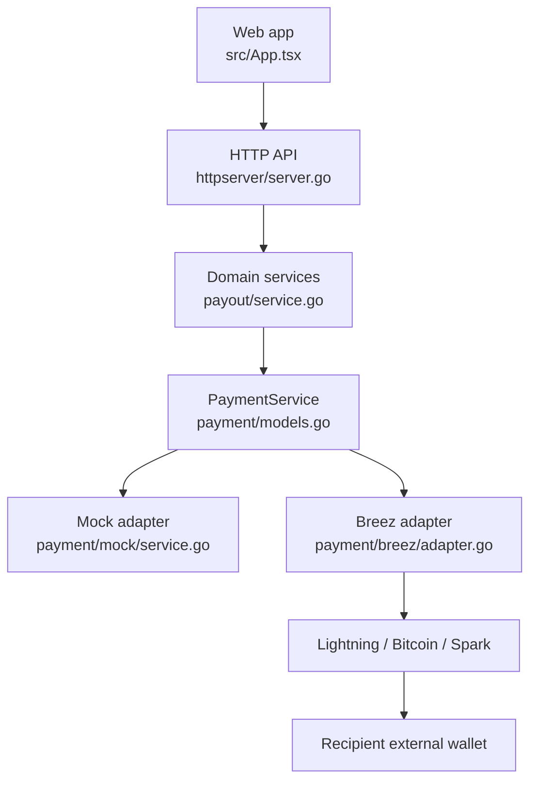

# Architecture

[English](../en-US/02-architecture.md) | [Português do Brasil](../pt-BR/02-architecture.md)

React contains display state but no payment trust decisions. HTTP handlers validate and map errors; the payout service owns approval, policy, idempotency, and domain settlement. SQLite persists business truth and uniqueness constraints. Provider types remain inside the Breez adapter.

One long-lived Breez SDK instance represents one small treasury. Events provide prompt updates; persisted provider IDs and `GetPayment` provide restart reconciliation. Mock mode replaces only the adapter, so the application workflow is identical.
