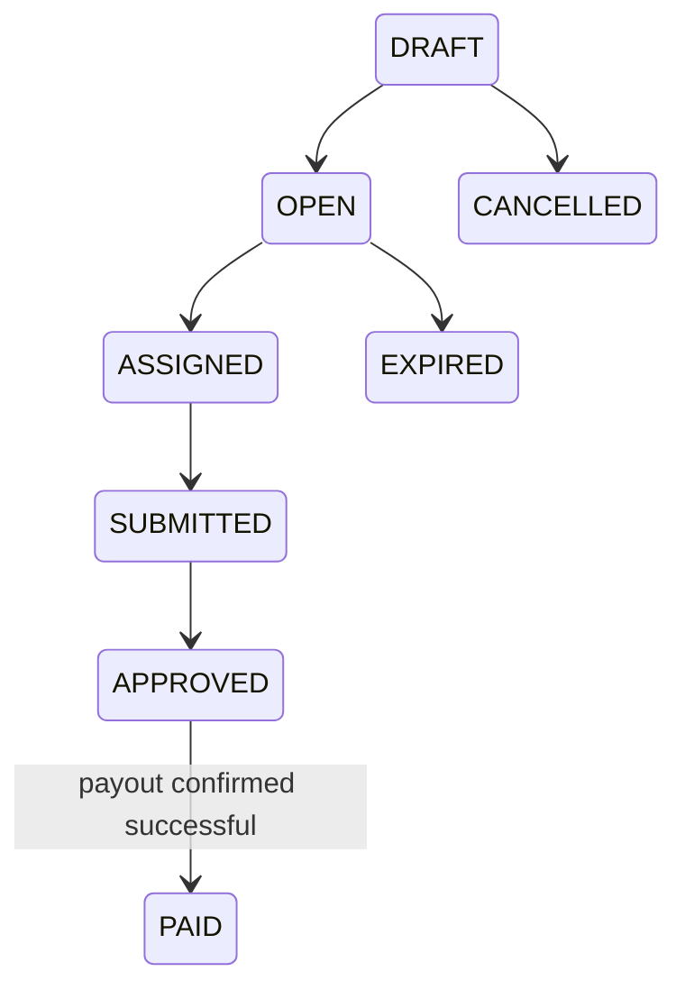
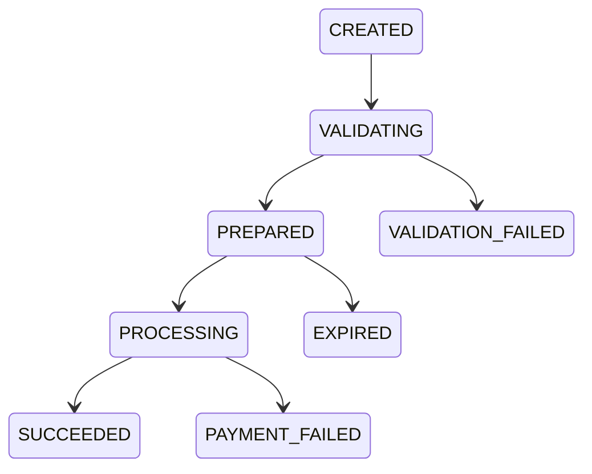

# Domain model

[English](../en-US/03-domain-model.md) | [Português do Brasil](../pt-BR/03-domain-model.md)

Separate concepts are bounty, assignment, submission, approval, payout, and payment provider. Approval authorizes a payout but does not prove that money moved.

Invariants: only approved submissions may be prepared; amount and destination freeze at preparation; a unique partial index permits only one successful payout per submission; confirmation requires an idempotency key; the key is persisted before the provider call; a different key cannot replace an existing payout. The bounty reaches `PAID` only while reconciling a provider `SUCCEEDED` result.

<!-- nav-footer -->

---

📄 **Code:** [`internal/payout/models.go`](../../services/freedom-bounties-api/internal/payout/models.go)

**[🏠 README](../../README.md)**  ·  ◀ [Architecture](02-architecture.md)  ·  [Payment lifecycle](05-payment-lifecycle.md) ▶
