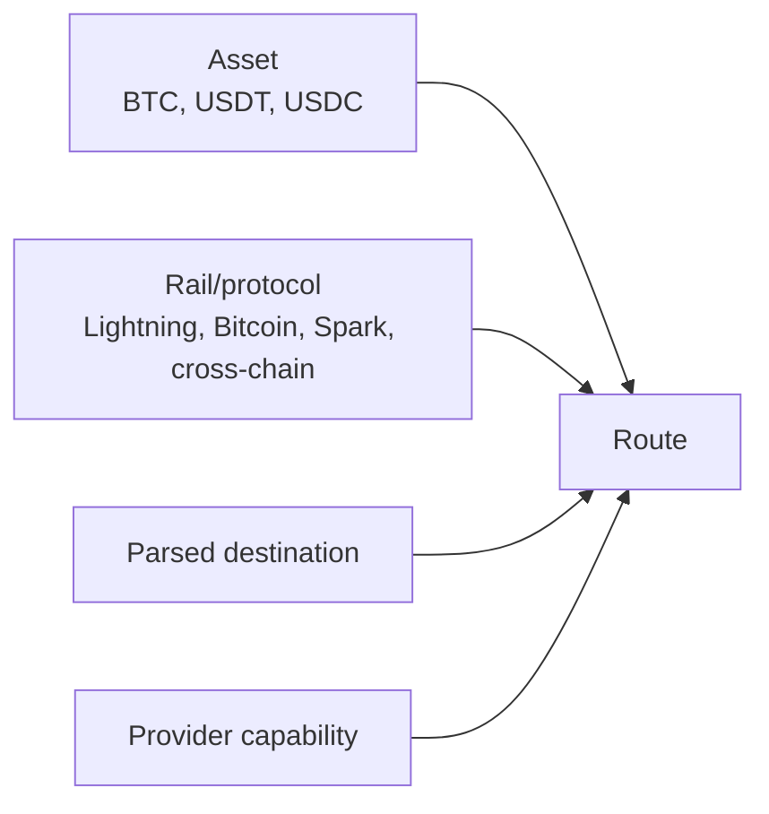

# Payment assets and rails

[English](../en-US/04-payment-assets-and-rails.md) | [Português do Brasil](../pt-BR/04-payment-assets-and-rails.md)

An **asset** is the unit transferred. A **rail** is how it travels. A **destination** is recipient-provided input. A **route** is a compatible combination selected after parsing. A **provider** implements it. BTC is stored as integer satoshis; tokens require integer base units, decimals, canonical identifier, and network metadata—never ticker alone and never floating point.

Supported real routes in the released Go adapter are BTC over Lightning, Bitcoin on-chain, and Spark. Current Breez documentation calls stablecoin delivery a cross-chain flow: source BTC sats or USDB is sent to a provider-controlled deposit, then USDC/USDT is delivered on a supported external chain. It is not modeled as a fictional universal “stablecoin over Spark” rail. See [implementation notes](00-implementation-notes.md).

<!-- nav-footer -->

---

📄 **Code:** [`internal/payment/models.go`](../../services/freedom-bounties-api/internal/payment/models.go)

**[🏠 README](../../README.md)**  ·  ◀ [Bitcoin, Lightning, Liquid, and Spark](19-bitcoin-lightning-liquid-spark.md)  ·  [Architecture](02-architecture.md) ▶
