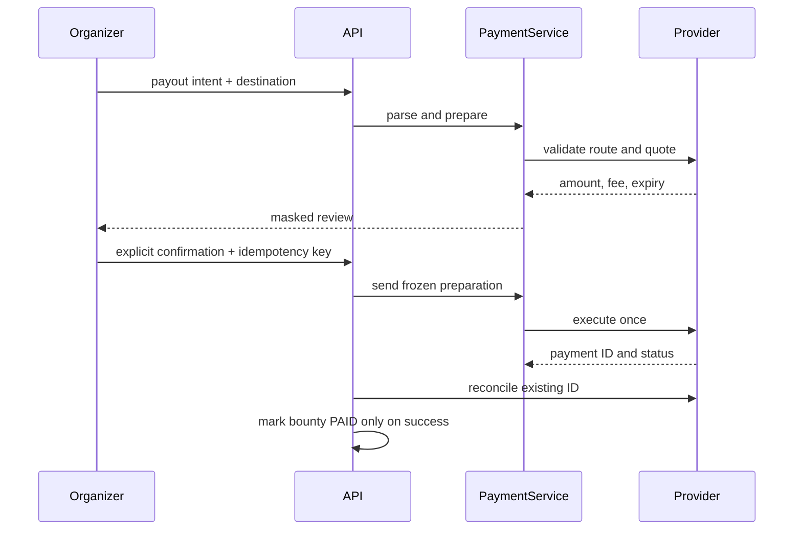

# Payment lifecycle

[English](../en-US/05-payment-lifecycle.md) | [Português do Brasil](../pt-BR/05-payment-lifecycle.md)

Errors are stable application codes, not SDK or SQL details. Pending and ambiguous sends are reconciled by provider ID. No retry creates a fresh payment intent automatically.
