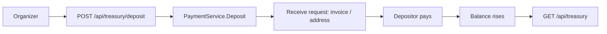

# Treasury and deposits

[English](../en-US/18-treasury-and-deposits.md) | [Português do Brasil](../pt-BR/18-treasury-and-deposits.md)

A payout treasury cannot pay from an empty balance. The lifecycle therefore begins with **funding**, not with a payout. The `PaymentService` port exposes two operations for this:

- `TreasuryInfo` — the current balance in satoshis and the treasury's own receiving identity (Lightning address, Spark address). The identity's public key stays server-side and is never sent to the browser.
- `Deposit` — mints a receive request (a Lightning invoice, or an on-chain / Spark address) that a depositor pays to fund the treasury.

## Two guards this enables

1. **Balance precheck.** `payout.Service.Prepare` reads `TreasuryInfo` and rejects with `INSUFFICIENT_TREASURY_FUNDS` when the balance cannot cover amount plus fee — up front, instead of failing at send time.
2. **Self-payment guard.** Pasting the treasury's own address or Lightning address as a payout destination is rejected with `SELF_PAYMENT_REJECTED` (HTTP 422). This prevents the treasury from circularly paying itself.

## Mock behavior

In mock mode the treasury starts **empty** so the deposit-first flow is visible. A deposit schedules a simulated incoming credit that clears after roughly one second (the same delay mock payments use to settle), so the balance visibly climbs from zero. A successful payout debits amount plus fee. The mock treasury's own identifiers — `treasury@freedombounties.demo`, `spark1freedomtreasurydemo`, `bc1qfreedomtreasurydemo` — trip the self-payment guard, letting you demonstrate that mistake safely.

## Real Breez mode

`TreasuryInfo` maps to the SDK's `GetInfo` (balance) plus `GetLightningAddress`, and `Deposit` maps to `ReceivePayment` with the method matching the chosen rail. Real on-chain and Spark deposits arrive out of band; the balance reflects them on the next `GetInfo`. Fund a separately controlled, low-value treasury — never paste a mnemonic into the browser.

<!-- nav-footer -->

---

📄 **Code:** [`internal/payment/mock/service.go`](../../services/freedom-bounties-api/internal/payment/mock/service.go) · [`internal/payment/breez/adapter.go`](../../services/freedom-bounties-api/internal/payment/breez/adapter.go)

**[🏠 README](../../README.md)**  ·  ◀ [Payment lifecycle](05-payment-lifecycle.md)  ·  [Running the demo](06-running-the-demo.md) ▶
