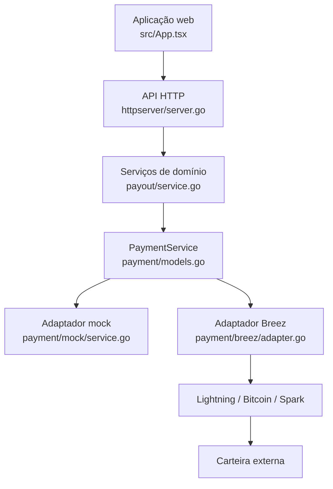

# Arquitetura

[English](../en-US/02-architecture.md) | [Português do Brasil](../pt-BR/02-architecture.md)

O React controla apresentação, não decisões de confiança. Handlers validam e mapeiam erros; o serviço de payout controla aprovação, políticas, idempotência e liquidação do domínio. O SQLite persiste a verdade e restrições únicas. Tipos Breez não saem do adaptador.

Uma instância duradoura do SDK representa um tesouro. Eventos agilizam atualizações; IDs persistidos e `GetPayment` permitem reconciliação após reinício. O mock substitui apenas o adaptador.

<!-- nav-footer -->

---

📄 **Código:** [`internal/payment/models.go`](../../services/freedom-bounties-api/internal/payment/models.go)

**[🏠 README](../../README.pt-BR.md)**  ·  ◀ [Ativos e meios de pagamento](04-payment-assets-and-rails.md)  ·  [Modelo de domínio](03-domain-model.md) ▶
