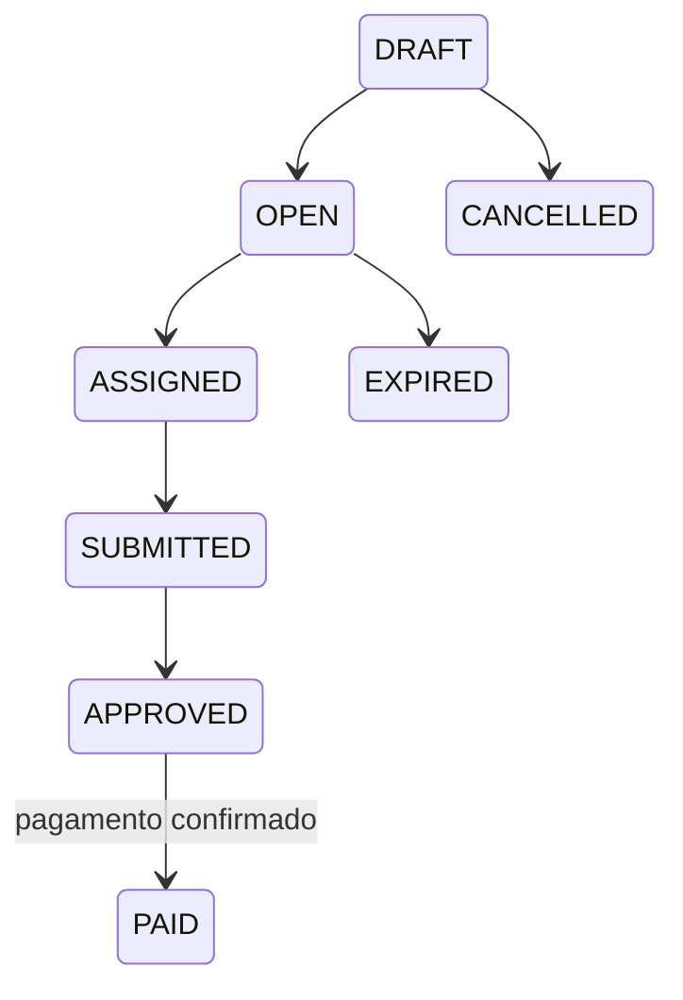
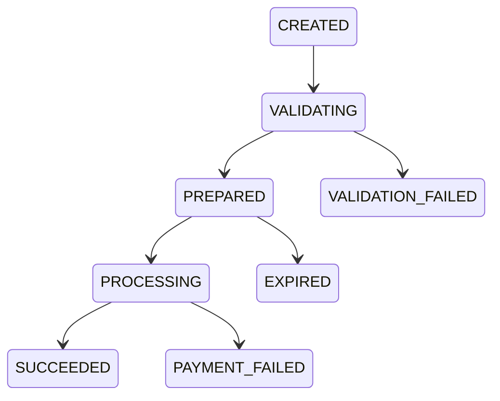

# Modelo de domínio

[English](../en-US/03-domain-model.md) | [Português do Brasil](../pt-BR/03-domain-model.md)

Recompensa, atribuição, entrega, aprovação, payout e provedor são conceitos separados. Aprovação autoriza pagar; não prova que houve pagamento.

Somente entregas aprovadas podem ser preparadas; valor e destino congelam; índice parcial permite um único sucesso por entrega; confirmação exige idempotência persistida antes do provedor. A recompensa vira `PAID` apenas após `SUCCEEDED` confirmado.

<!-- nav-footer -->

---

📄 **Código:** [`internal/payout/models.go`](../../services/freedom-bounties-api/internal/payout/models.go)

**[🏠 README](../../README.pt-BR.md)**  ·  ◀ [Arquitetura](02-architecture.md)  ·  [Ciclo do pagamento](05-payment-lifecycle.md) ▶
