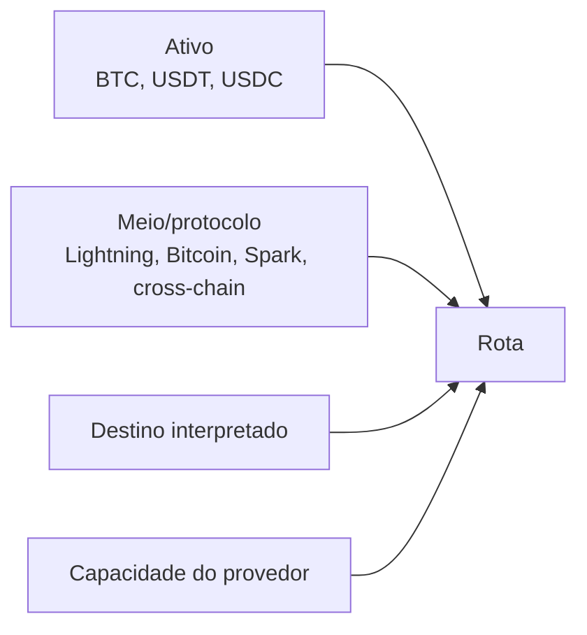

# Ativos e meios de pagamento

[English](../en-US/04-payment-assets-and-rails.md) | [Português do Brasil](../pt-BR/04-payment-assets-and-rails.md)

**Ativo** é a unidade transferida; **meio** é como ela viaja; **destino** vem da destinatária; **rota** combina opções compatíveis; **provedor** executa. BTC usa satoshis inteiros. Tokens exigem unidades-base inteiras, decimais, identificador canônico e rede — nunca só ticker nem ponto flutuante.

O adaptador real lançado atende BTC por Lightning, Bitcoin on-chain e Spark. A entrega de stablecoin documentada pela Breez é cross-chain, em duas etapas a partir de sats ou USDB; não é um falso meio universal “stablecoin sobre Spark”.
