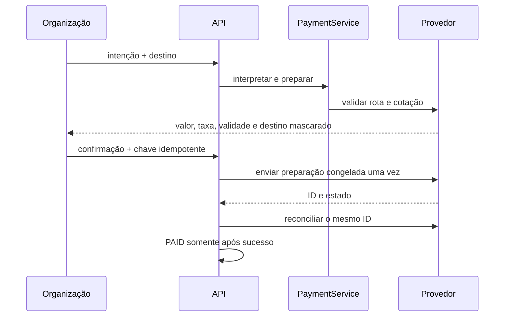

# Ciclo do pagamento

[English](../en-US/05-payment-lifecycle.md) | [Português do Brasil](../pt-BR/05-payment-lifecycle.md)

O ciclo começa antes deste diagrama: a tesouraria precisa ser financiada primeiro. Veja [tesouraria e depósitos](18-treasury-and-deposits.md) para o passo de depósito, a verificação prévia de saldo e a proteção contra autopagamento que condicionam o `prepare`.

Erros expõem códigos estáveis, não SQL ou detalhes do SDK. Resultado pendente ou ambíguo é reconciliado pelo ID existente; nunca se cria nova intenção automaticamente.

<!-- nav-footer -->

---

📄 **Código:** [`internal/payout/service.go`](../../services/freedom-bounties-api/internal/payout/service.go)

**[🏠 README](../../README.pt-BR.md)**  ·  ◀ [Modelo de domínio](03-domain-model.md)  ·  [Tesouraria e depósitos](18-treasury-and-deposits.md) ▶
