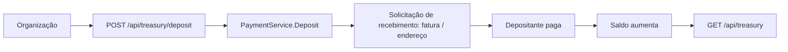

# Tesouraria e depósitos

[English](../en-US/18-treasury-and-deposits.md) | [Português do Brasil](../pt-BR/18-treasury-and-deposits.md)

Uma tesouraria de pagamentos não paga com saldo zero. Por isso o ciclo começa com o **financiamento**, não com um pagamento. A porta `PaymentService` expõe duas operações para isso:

- `TreasuryInfo` — o saldo atual em satoshis e a identidade de recebimento da própria tesouraria (endereço Lightning, endereço Spark). A chave pública da identidade permanece no servidor e nunca é enviada ao navegador.
- `Deposit` — gera uma solicitação de recebimento (uma fatura Lightning ou um endereço on-chain / Spark) que um depositante paga para financiar a tesouraria.

## Duas proteções habilitadas por isso

1. **Verificação prévia de saldo.** `payout.Service.Prepare` lê `TreasuryInfo` e rejeita com `INSUFFICIENT_TREASURY_FUNDS` quando o saldo não cobre valor mais taxa — de forma antecipada, em vez de falhar na hora do envio.
2. **Proteção contra autopagamento.** Colar o próprio endereço ou endereço Lightning da tesouraria como destino do pagamento é rejeitado com `SELF_PAYMENT_REJECTED` (HTTP 422). Isso evita que a tesouraria pague a si mesma em círculo.

## Comportamento no modo mock

No modo mock a tesouraria começa **vazia** para que o fluxo que inicia pelo depósito fique visível. Um depósito agenda um crédito de entrada simulado que é confirmado após cerca de um segundo (o mesmo atraso que os pagamentos mock usam para liquidar), de modo que o saldo sobe visivelmente a partir do zero. Um pagamento bem-sucedido debita valor mais taxa. Os identificadores da própria tesouraria mock — `treasury@freedombounties.demo`, `spark1freedomtreasurydemo`, `bc1qfreedomtreasurydemo` — acionam a proteção contra autopagamento, permitindo demonstrar esse erro com segurança.

## Modo Breez real

`TreasuryInfo` corresponde ao `GetInfo` (saldo) mais `GetLightningAddress` do SDK, e `Deposit` corresponde a `ReceivePayment` com o método adequado ao trilho escolhido. Depósitos reais on-chain e Spark chegam fora de banda; o saldo os reflete no próximo `GetInfo`. Financie uma tesouraria de baixo valor e controlada à parte — nunca cole uma frase-semente no navegador.
